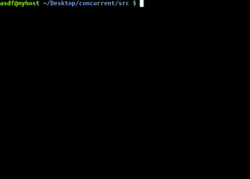

# Concurrent [](https://travis-ci.org/Chocobo1/concurrent) [](https://ci.appveyor.com/project/Chocobo1/concurrent)

A naive tool that take cmd line commands (from text file or pipe) and execute concurrently:



It will automatically distribute the commands to CPU cores, the logical ones as much as you have except one (which is reserved for OS).

If you seek a more powerful tool: [GNU Parallel](https://www.gnu.org/software/parallel/).

## Usage

* Issue commands via stdin (pipe) input:
  ```shell
someCmdGenerator | concurrent -
  ```

* Issue commands via file:
  ```shell
concurrent <path_to_file>
  ```


## Special directives

* Fence: Will wait for **all** executing commands (i.e. all commands before this directive) to finish and then continue on.
  ```
### Fence ###
  ```
 or
  ```
rem Fence rem
  ```

* Change the number of commands executing in parallel:
  ```
### Threads: <# of jobs> ###
  ```
 or
  ```
rem Threads: <# of jobs> rem
  ```

* Comment keyword: {`#`, `rem`}, the same as shell script & batch comment keyword.

  Lines starting with these keywords will be ignored.


## Compile

Get yourself a [C++11 compiler](http://en.cppreference.com/w/cpp/compiler_support) and run:
  ```shell
cd src
make -j2
  ```

To run tests:
  ```shell
git submodule update --init --remote --depth 1  # init git submodule
cd src
make -j2 test
  ```


## Downloads

Download win32 executables [here](../../releases)


## Third-party code

* [Catch](https://github.com/philsquared/Catch)
